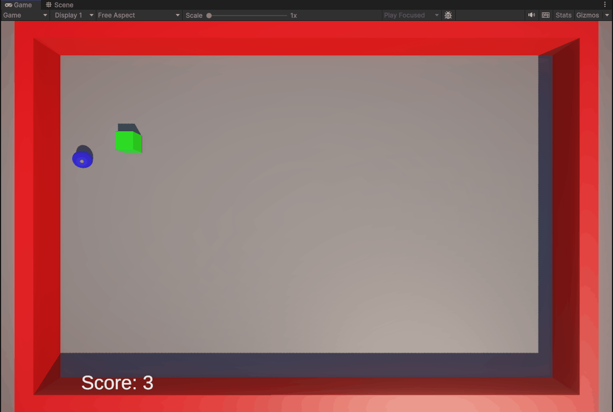

# Interfaces Inteligentes  
## Práctica 4 - Delegados - Eventos  
  
- Ejercicio 1:  
El cilindro notifica a las esferas si el cubo choca con él. Las esferas del grupo 1 cambian de color, las del grupo 2 se desplazan hacia el cilindro  
  

- Ejercicio 2:  
El cubo notifica a las esferas si choca con algún objeto. Si choca con algún objeto que no sean esferas del grupo 1, las esferas del grupo 1 se desplazan hacia el cilindro. Si choca con esferas del grupo 1 las esferas del grupo 2 aumentan de tamaño  
  

- Ejercicio 3:  
El cilindro notifica a las esferas si el cubo se acerca a él. Las esferas del grupo 1 cambian de color y saltan, las esferas del grupo 2 se orientan hacia el cilindro  
  

- Ejercicio 4:  
El cubo recoge esferas y suma 5 puntos por cada esfera del grupo 1 y 10 por cada esfera del grupo 2. Los puntos se muestran por consola  
  

- Ejercicio 5:  
El cubo recoge esferas y suma 5 puntos por cada esfera del grupo 1 y 10 por cada esfera del grupo 2. Los puntos se muestran por pantalla mediante una UI  
  

- Ejercicio 6:  
La esfera detecta la colisión con el cubo y se lo notifica al cubo. El cubo se desplaza a una posición aleatoria, suma uno a la puntuación y la muestra por pantalla mediante una UI  
  